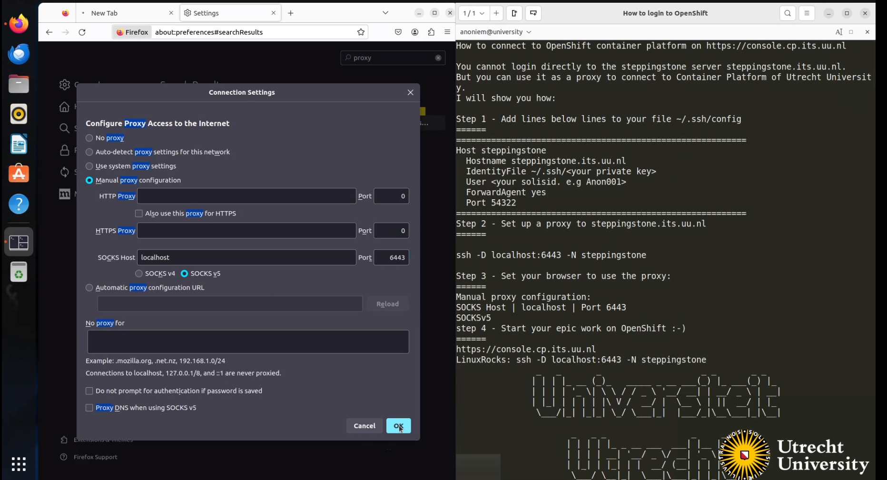

# GettingStarted
Here you will find information on how to connect to the platform through the steppingstone server.

## How to connect to OpenShift4 container platform [console](https://console.cp.its.uu.nl)

You cannot login directly to the steppingstone server steppingstone.its.uu.nl
But you can use it as a proxy to connect to the OpenShift4 container platform of the University Utrecht.

### Steps
1. add lines below to your `~/.ssh/config` file

```bash
Host steppingstone
    HostName steppingstone.its.uu.nl
    IdentityFile ~/.ssh/<your-private-key>
    User <your-username>
    ForwardAgent yes
    Port 54322 (or 22)
```
set env vars
```bash
export HTTP_PROXY=socks5://127.0.0.1:6443
export HTTPS_PROXY=socks5://127.0.0.1:6443
```

2. Set up the proxy:


    ssh -D localhost:6443 -N steppingstone


3. Set your browser to use the proxy:

```bash
manual proxy configuration:
SOCKS Host: localhost Port: 6443
SOCKS v5
```



4. Open the OpenShift4 console in your browser: [console](https://console.cp.its.uu.nl)

5. Start your epic work on OpenShift ;-)

6. Login using cli
Get your login command from the OpenShift4 console and execute it in your terminal.

```bash
oc login --token=<your-token> --server=https://localhost:6443
```

### Movie How to connect to OpenShift4 container platform
<iframe src="https://player.vimeo.com/video/932020706?badge=0&amp;autopause=0&amp;player_id=0&amp;app_id=58479" width="480" height="270" frameBorder="1" class="giphy-embed" ; encrypted-media; gyroscope; picture-in-picture; allowfullscreen" title="oc_toegang2fa"></iframe>

### Troubleshooting
If you have trouble connecting to the OpenShift4 api, you can try the following:
Alternatively, you can reach the OpenShift4 api like this: 
```bash
ssh -i ~/.ssh/<your-private-key> 6443:console.cp.its.uu.nl:6443 -D 3333 <your-username>@steppingstone.its.uu.nl 
```
and use the oc login like so:
```bash
oc login --token=<your-token> --server=https://localhost:6443
``` 
