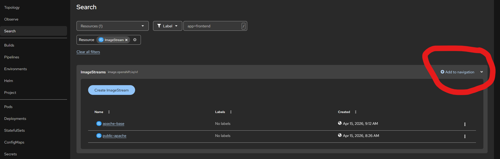

Before you can access the <a href="https://console.cp.its.uu.nl" target="_blank">admin console</a>, you'll have to setup an ssh tunnel through the steppingstone server.

## Prerequisites
- [x] You need to have a Solisid at the University Utrecht with 2fa enabled.
- [x] You need to have an account on the steppingstone server of the University Utrecht.
- [x] You need to have a project/ namespace on the OpenShift4 container platform of the University Utrecht.

If you do not have these prerequisites, please contact one of the service delivery managers of the Utrecht University.
You can find all the information on how to do that on the <a href="https://manuals.uu.nl" target="_blank">manuals</a>
website.  
For a quick overview of what you will be doing check: <a href="https://kubernetes.io/docs/tasks/extend-kubernetes/socks5-proxy-access-api/" target="_blank">k8s socks5-proxy-access-api</a>

## Adding resources to the web console
By default, the web consoles navigation only shows the most used resources, but you can easily add more resources to the
navigation. To do this, navigate to the `Search` page (`https://console.cp.its.uu.nl/search-page/ns/YOUR-NAMESPACE`)
and search for the resource you want to add. 

In this example we will add `ImageStream` to the navigation. 

Use the `Add to navigation` button to add the resource to the navigation. When pressed
the resource will appear in the left navigation bar, and you can easily access it from there.