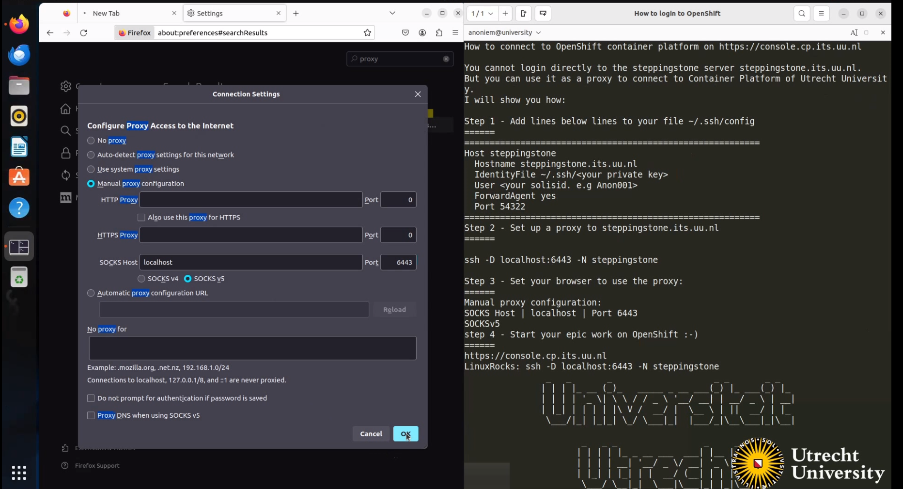

Before you can access the <a href="https://console.cp.its.uu.nl" target="_blank">admin console</a> or the oc client, you'll have to setup an ssh tunnel through the steppingstone server.

## Prerequisites
- You need to have a Solisid at the University Utrecht with 2fa enabled.
- You need to have an account on the steppingstone server of the University Utrecht.
- You need to have a project/ namespace on the OpenShift4 container platform of the University Utrecht.

If you do not have these prerequisites, please contact one of the service delivery managers of the Utrecht University.
You can find all the information on how to do that on the <a href="https://manuals.uu.nl" target="_blank">manuals</a>
website.  
For a quick overview of what you will be doing check: <a href="https://kubernetes.io/docs/tasks/extend-kubernetes/socks5-proxy-access-api/" target="_blank">k8s socks5-proxy-access-api</a>

## Option 1: **sshuttle** (recommended)

### Pre-requisites

- Install sshuttle on your local machine
  <a href="https://sshuttle.readthedocs.io/en/stable/installation.html" target="_blank">sshuttle-docs</a>

> If for some reason you don't have a Mac or Linux machine, you can use the Windows Subsystem for Linux (WSL) to install sshuttle <a href="https://docs.microsoft.com/en-us/windows/wsl/install-win10" target="_blank">wsl-docs</a>

### Steps

1. Run the command below in your terminal  
   `sshuttle -r solisid@steppingstone.its.uu.nl -x steppingstone.its.uu.nl 0.0.0.0/0`
2. Fill in your 2fa code when prompted

Now the gui and cli of OpenShift are accessible, so you can start your epic work on OpenShift :-)
> sshuttle is a VPN tool that transparently tunnels your internet traffic over SSH, combining the simplicity of SSH with
> the capabilities of a VPN. It allows you to route traffic from your local machine through a remote server, effectively
> providing a secure and encrypted connection without needing root access on the client
> side. <a href="https://sshuttle.readthedocs.io/en/stable/usage.html" target="_blank">sshuttle-docs</a>

## Option 2: socks5-proxy

### Steps for the GUI
Add lines below to your `~/.ssh/config` file.
```bash
Host steppingstone
    HostName steppingstone.its.uu.nl
    IdentityFile ~/.ssh/<your-private-key>
    User <your-username>
    ForwardAgent yes
    Port 22
```
If you don't have an ssh/config file, create one.

Set environment variables for the proxy in your terminal
```bash
export HTTP_PROXY=socks5://127.0.0.1:6443
export HTTPS_PROXY=socks5://127.0.0.1:6443
```

Set up the proxy
```bash
ssh -D localhost:6443 -N steppingstone
```

Set your browser to use the proxy
```bash
SOCKS Host: localhost Port: 6443
SOCKS v5
```


Open the OpenShift console in your browser: <a href="https://console.cp.its.uu.nl" target="_blank">console</a>

Start your epic work on OpenShift ;-)

### Walkthrough movie
<iframe src="https://player.vimeo.com/video/932020706?badge=0&amp;autopause=0&amp;player_id=0&amp;app_id=58479" width="480" height="270" frameBorder="1" class="giphy-embed" ; allow="autoplay; fullscreen; picture-in-picture; clipboard-write"  title="oc_toegang2fa"></iframe>

### Steps for the CLI
Run the following command from your CLI.
```bash
oc login --web https://api.cl01.cp.its.uu.nl:6443
```
A browser will open where you can log in.

Or:

Get your login command from the OpenShift console and execute it in your terminal.
Click on your username in the right top corner and select `Copy Login Command`.
```bash
oc login --token=<your-token> --server=https://localhost:6443
```

### Troubleshooting
If you have trouble connecting to the OpenShift api, you can try the following:
- Check if the proxy is set correctly.
- Check if the proxy is running.
- Check if the OpenShift console is reachable.
- Check if there are no conflicting settings in your `~/.ssh/config` file.

If you have trouble reaching the api through the cli, you can also set up your connection like so: 

#### Proxy setup for the CLI
Make sure to set the correct port:
```bash
ssh -i ~/.ssh/<your-private-key> 6443:console.cp.its.uu.nl:6443 -D 3333 <your-username>@steppingstone.its.uu.nl 
```

Use the oc login like so:
```bash
oc login --token=<your-token> --server=https://localhost:6443
```
