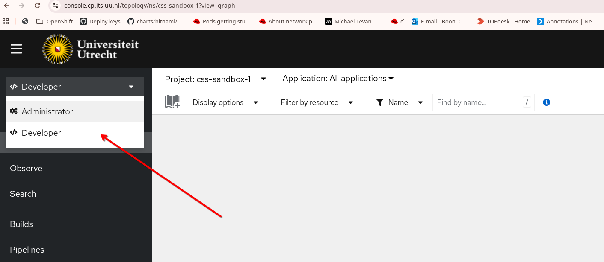
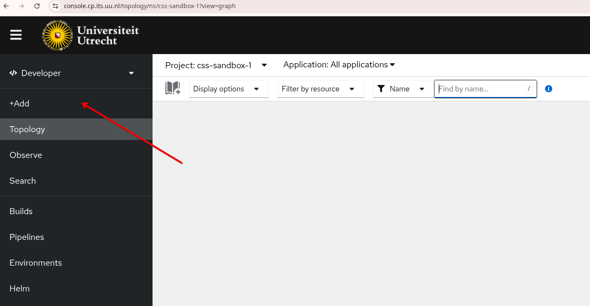
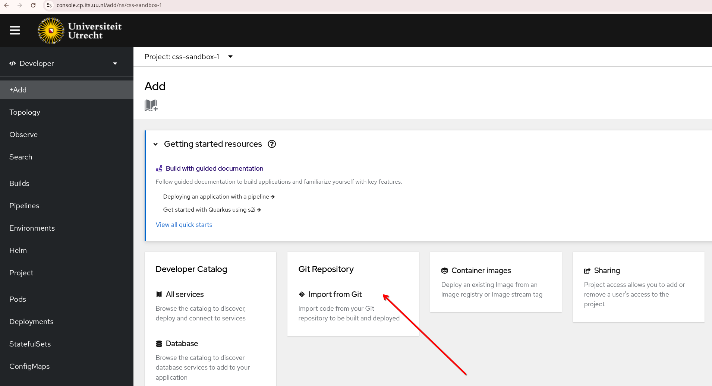
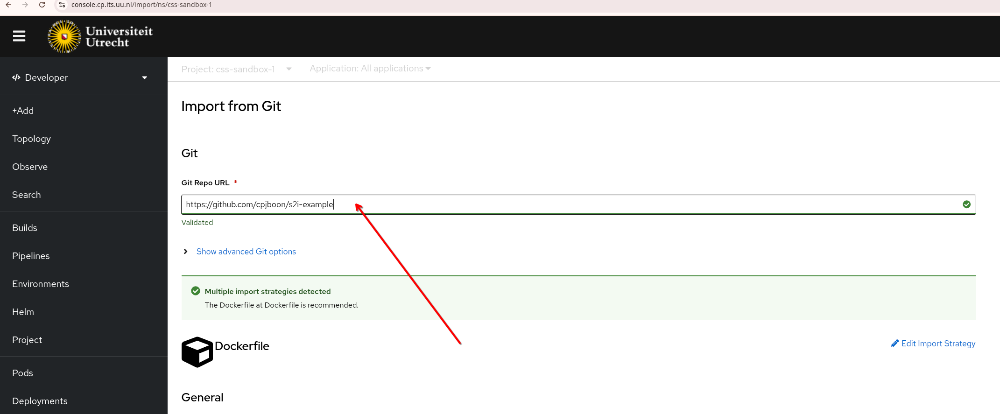
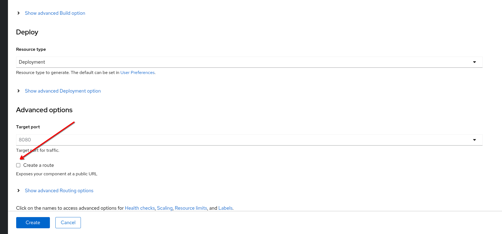
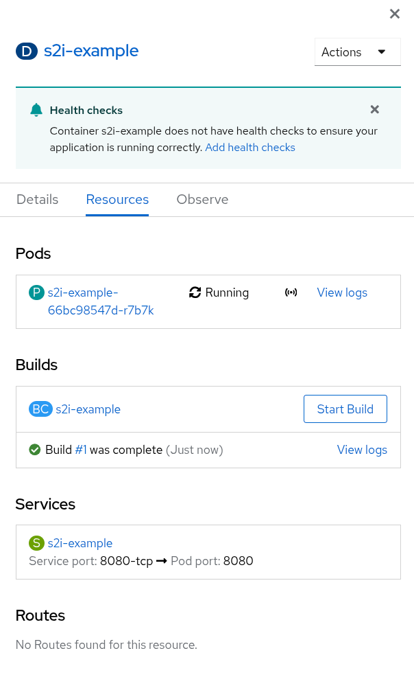
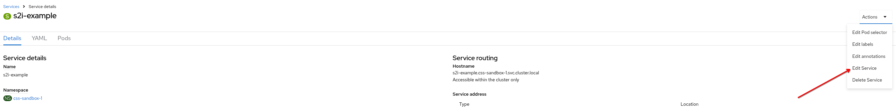
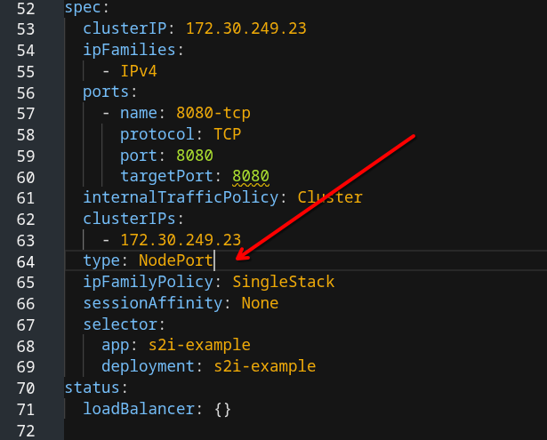
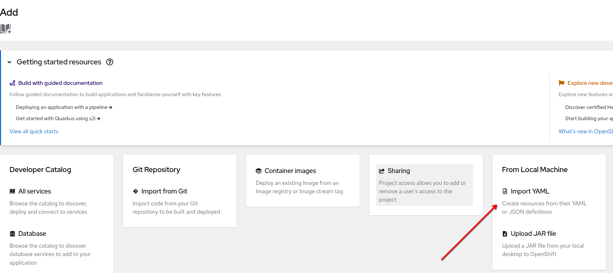
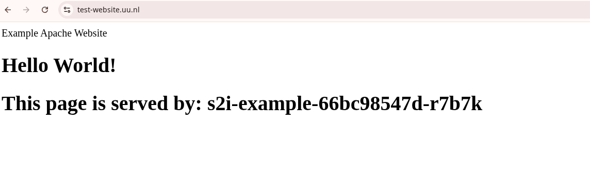

# Modify Automatically created Service / Route in the OpenShift Console to VPX load balancer
This guide will help you use the VPX load balancer instead of the default router in the GUI when using a build config (Import from Git). 
Note that you only need to configure the VPX load balancer when access to your application from outside the cluster (the internet) is required.  
If internet access is not required, this procedure is not needed.

## Prerequisites

- [x] **Have a DNS entry (CNAME) for your site**

  Create a network DNS change in Topdesk to apply for your DNS name.  
  e.g. `test-website.uu.nl` --> `vpx-cl01.cp.its.uu.nl`
  CNAME test-website.uu.nl (vpx-cl01.cp.its.uu.nl)

```bash
  $ dig +short test-website.uu.nl 
  vpx-cl01.cp.its.uu.nl.
  131.211.5.163
```

  for this walkthrough, the url test-website.uu.nl is used as an example.

## Steps

Within OpenShift, you can create an application simply by importing code from a Git repository. 
This is called source to image (s2i). This code can be a Dockerfile or simply some html, golang, java, php source code and many more.
There has to be a matching builder image.
When the Git repository contains a Dockerfile, the container image is build and pushed into the internet registry.
When the Git repository contains source code, a builder image pulls the source code and creates a target image that is pushed into the internal registry.  
  

Then Openshift automatically creates a Build Config, a Deployment, a Service and a Route.
Because for applications that needs to be accessible externally, some modification is needed to use the VPX load balancer instead.  
This guide is showing step by step what needs to be modified, using an example Git repository that contains a Dockerfile.

First login to OpenShift and select the Developer perspective. Also make sure the correct Project is selected



Select Add.



Select Import from Git



In the field Git Repo URL paste the URL where the source code (or Dockerfile) is located.



OpenShift now automatically checks in the Git repo what it should do. In this case it contains a Dockerfile so the strategy will be Dockerfile.  
Make sure to uncheck the Create a route checkbox. As mentioned before, this is only necessary when you have a public facing application.



Then press Create.  
Now you get a Topology overview. 
On the right side you can see if the build succeeded and if the pods are running.  
There is a service created called s2i-example



Now we need to edit the service to make it of type NodePort. Under Service press the name of the service, here s2i-example:



Change type: ClusterIP into NodePort:



and press Save. Now add the ingress. Press Add again:


Then under From Local Machine select Import Yaml



Paste below code and modify it.

```code
apiVersion: networking.k8s.io/v1
kind: Ingress
metadata:
  name: test-website-vpx
  annotations:
    acme.cert-manager.io/http01-edit-in-place: "true"
    cert-manager.io/cluster-issuer: harica
    ingress.citrix.com/insecure-termination: redirect

spec:
  ingressClassName: nsic-vpx
  rules:
  - host: test-website.uu.nl			  					
    http:
      paths:
      - backend:
          service:
            name: s2i-example          
            port:
              number: 8080
        path: /
        pathType: Prefix
  tls:
    - hosts:
        - test-website.uu.nl
      secretName: test-website-tls      
```


Modify the fields:

```
metadata:
  name: test-website-vpx # Give a meaningful name
```

```
  rules:
  - host: test-website.uu.nl # Change into your CNAME	
```

```
  tls:
    - hosts:
        - test-website.uu.nl # Change into your CNAME
      secretName: test-website-tls # Give a meaningful name 
```

```
      - backend:
          service:
            name: s2i-example  # Use the modified NodePort service
```

Finally press Create at the bottom.  
  
cert-manager will now create a certificate and stores it in the secret under secretName.
Then you can test your application in the browser:




