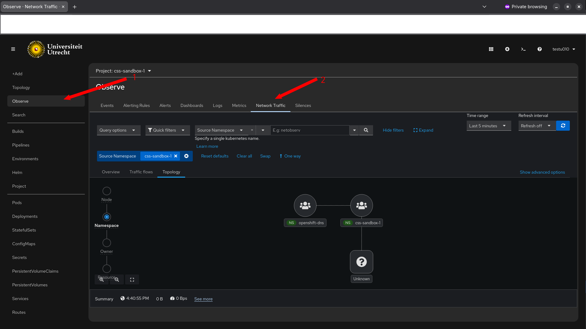
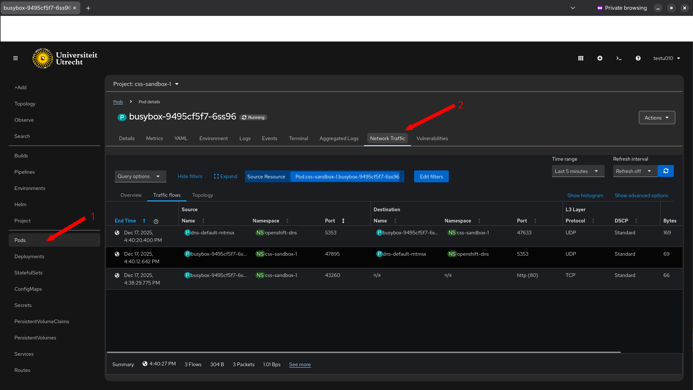

# Observe Network Traffic with Netobserv

Netobserv has docs and a blog, which you can find here:  
[Netobserv Documentation](https://netobserv.io/about/)

## Netobserv Gui interface
???+ info "Generate some traffic"
    For netobserv to work you have to generate some traffic. You can use `kubectl exec` to run some curl commands from one pod to another, or to an external service.

<b>Observe</b>  
Click on `Observe` in the left sidebar to open the network observability dashboard.

<b>Tab</b>  
You also have a tab on workloads, for instance pods:

