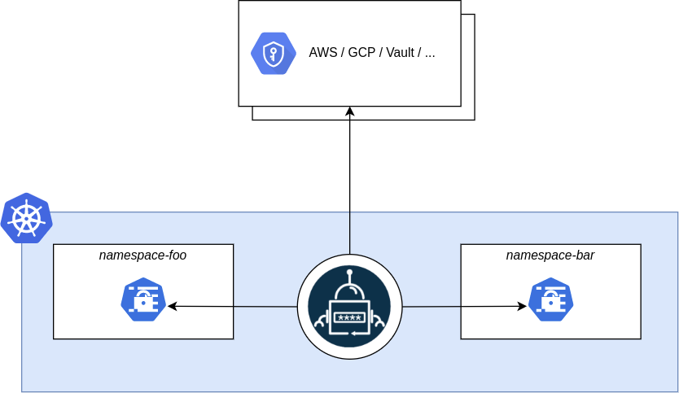
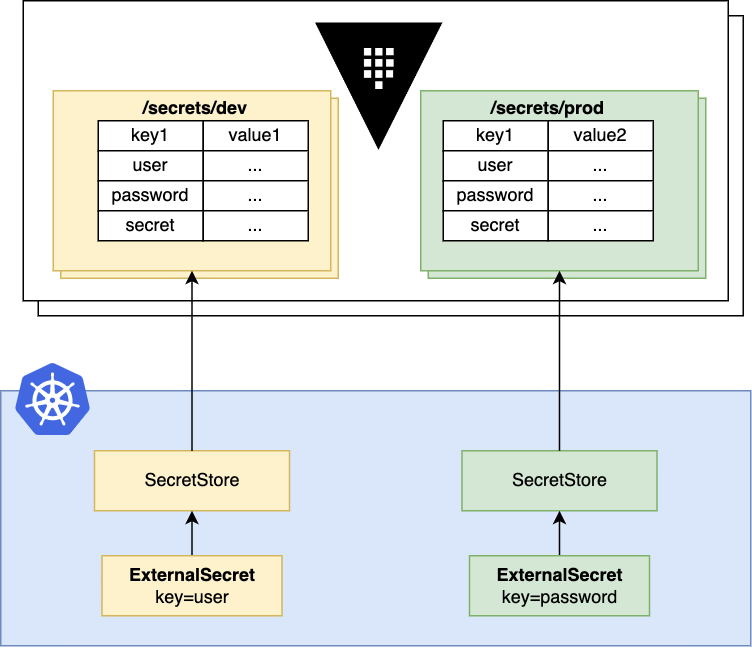

# Vaulted Secrets - Proof of concept setup in SNI

For a proof of concept a Single Node Infranode (SNI) Openshift cluster was created and two helm charts were installed and configured:  
- [OpenBao](https://openbao.org)  
- [External Secrets Operator](https://external-secrets.io/)  

Both projects are affiliated with linux foundation making them a robust choice.
The overview of the concept looks like the flow diagram below.



The External Secrets Operator syncs secrets from a Vault/OpenBao towards Kubernetes namespaces.
As stated in the External Secrets Operator docs, coupling with OpenBao is supported <https://external-secrets.io/latest/provider/openbao/>.

## OpenBao
OpenBao is an opensource fork of HashiCorp Vault. We can view both OpenBao and HashiCorp Vault as a secret stores for consumption by apps (instead of human users as in case of Vaultwarden).

### Why use OpenBao?
Benefits of using OpenBao include:
- Centralized Management: Store all secrets in one place, reducing the risk of exposure.  
- Dynamic Secrets: Applications can retrieve secrets dynamically, ensuring they are always up-to-date.  
- Access Control: Fine-grained access policies can be enforced, allowing only authorized services to access specific secrets.  
- Potential to setup outside the cluster in VMs to increase resilience/security.  

### OpenBao setup
After authenticating to the SNI, OpenBao can be easily installed with helm as described in the official documentation <https://openbao.org/docs/platform/k8s/helm/>.
Following the installation, OpenBao must be [unsealed](https://openbao.org/docs/concepts/seal/) from the GUI or the command line (by accessig the pod) <https://openbao.org/docs/commands/operator/unseal/>.
Save the Unseal Keys and Root Token for later.
Verify unsealing by running `bao status` or `vault status`. The two commands are equivalent since OpenBao is a fork of HashiCorp Vault.
Now get a shell in the OpenBao pod and create a path with `kv` secrets engine and a secret:
```
bao secrets enable -path=topsecret kv
bao kv put topsecret/hidden foo=bar
```
The secret can be verified through the command line or the GUI (they both eventually access the OpenBao API).

## External Secrets Operator
External Secrets Operator is a Kubernetes operator that integrates external secret management systems like AWS Secrets Manager, HashiCorp Vault, Google Secrets Manager, Azure Key Vault, IBM Cloud Secrets Manager, CyberArk Secrets Manager, Pulumi ESC and more. The operator reads information from external APIs and automatically injects the values into a Kubernetes Secret.

### Why use External Secrets Operator?
We need a way to synchronize OpenBao secrets into Kubernetes namespaces. Other solution were considered (Vault Secrets Operator or RedHat managed External Secrets Operator) but didn't suit either because they are commercial or SNI limitations. In this PoC, we use the External Secrets Operator as described in the open source docs <https://external-secrets.io/latest/introduction/getting-started/>.

### Flow diagram of the resources
Conceptually, the data flows as seen in the diagram below.


The upper half belongs to the Vault and the lower to the cluster.

Source: <https://external-secrets.io/latest/provider/hashicorp-vault/>

### External Secrets Operator setup
After authenticating to the SNI, External Secrets Operator can be easily installed with helm as described in the official documentation <https://external-secrets.io/latest/introduction/getting-started/> (see Option 1). Now you can define CRDs - **ExternalSecret, SecretStore and ClusterSecretStore** that provide a user-friendly abstraction for the external API that stores and manages the lifecycle of the secrets.

To continue apply the following YAMLs.  
In this PoC, we'll use the root token to authenticate to OpenBao, of course different methods/approles are available for more fine-grained access.
We need to base64 encode the token `echo -n '<root_token>' | base64` then place it in the `Secret` below.

```yaml
apiVersion: v1
kind: Secret
metadata:
  name: bao-token
data:
  token: <base64encoded_root_token>
```

Time to define a `SecretStore` and an `ExternalSecret` to sync the secret we created in OpenBao!

```yaml
apiVersion: external-secrets.io/v1
kind: SecretStore
metadata:
  name: bao-token-backend
spec:
  provider:
    vault:
      server: "http://openbao.default.svc.cluster.local:8200"
      path: "topsecret"
      version: "v1"
      auth:
        tokenSecretRef:
          name: "bao-token"
          key: "token"
---
apiVersion: external-secrets.io/v1
kind: ExternalSecret
metadata:
  name: bao-topsy
spec:
  refreshInterval: 1h
  secretStoreRef:
    name: bao-token-backend
    kind: SecretStore
  target:
    name: bao-topsy
  data:
    - secretKey: foo
      remoteRef:
        key: hidden
        property: foo
```
The `SecretStore` must show up as validated in the events log and the `ExternalSecret` as synced. A Kubernetes `Secret` has been automagically created, bingo!

???+ info "`ClusterSecretStore`"
    In case of a ClusterSecretStore, be sure to provide the `namespace` for `tokenSecretRef` which is the one that the `bao-token` `Secret` was created.

ie.
```yaml
apiVersion: external-secrets.io/v1
kind: ClusterSecretStore
metadata:
  name: bao-token-backend
  namespace: external-secrets-operator
spec:
  provider:
    vault:
      server: "http://openbao.default.svc.cluster.local:8200"
      path: "topsecrets"
      version: "v1"
      auth:
        tokenSecretRef:
          namespace: "default"
          name: "bao-token"
          key: "token"

```

## Notes
- The above setup worked fine in Minikube as well.
- The above setup doesn't refer to High Availability mode of OpenBao. For more hints and info on it see <https://nanibot.net/posts/vault/> and <https://openbao.org/docs/2.3.x/internals/high-availability/>.